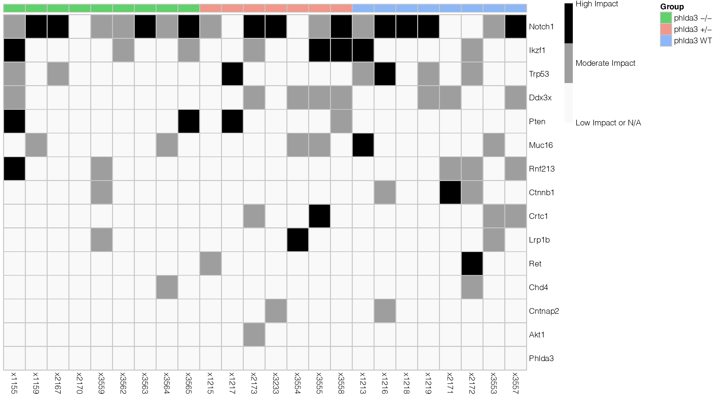
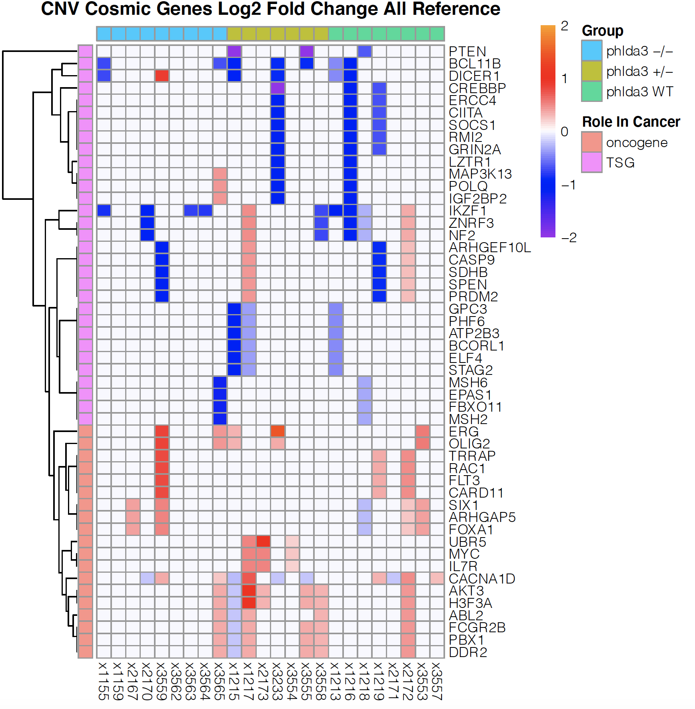
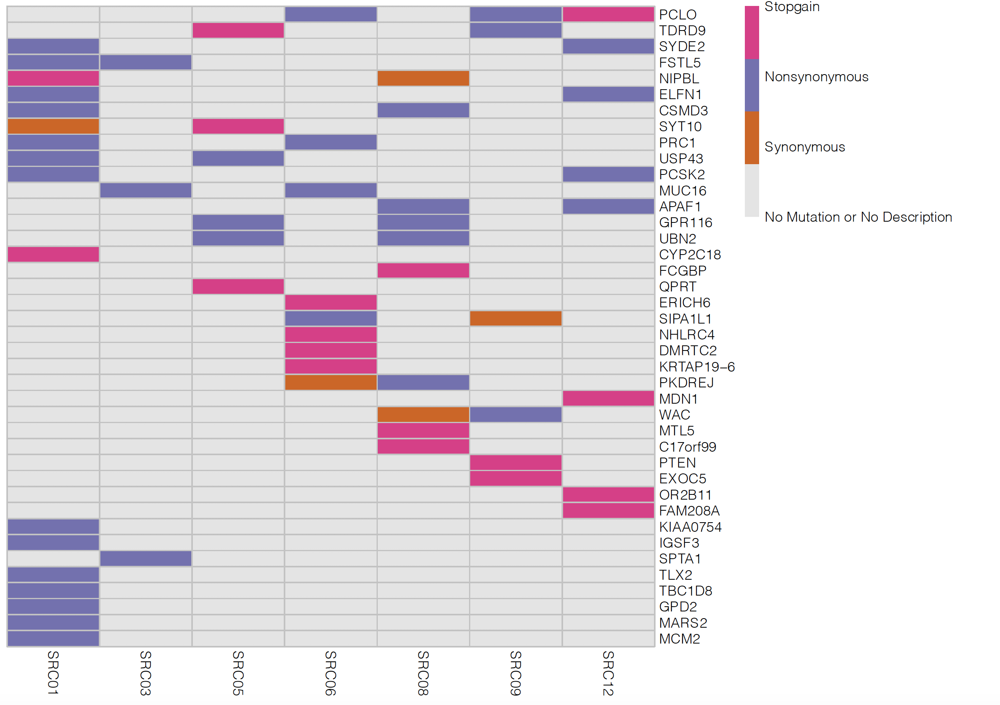
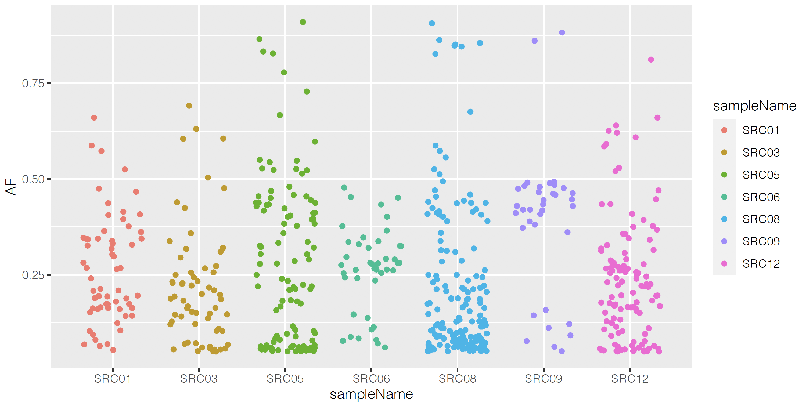

# WholeExomeSequencing
Takes BAM files and returns SNVs and CNVs. Additional scripts allow for analysis and plotting. 

All shell scripts are designed for use on the Stanford Computing Cluster, and therefore have some dependencies that are not universally accessible, however most dependencies listed in the main shell script are publically available. 

The data used in these examples is used by in-progress research, and will be released upon publication. These graphs are just examples of some of the analysis capabilities of my scripts. These examples come from paired tumor/normal tissue biopsies. 

## Example Outputs

### VEP Mutation Impact Graph

### Copy Number Variation of Cosmic Genes 

The following are results from a sister pipeline which uses multiple variant callers using proprietary scripts that are not mine. I just wrote some of the annotation scripts as well as the analysis for this.

### Consensus Calling Results from ExomePlottingHuman.R

### Allele Frequency Distribution

Big thanks to jhchabon for providing critical dependency scripts and the overall framework design of the MousePipelineDeduped.sh Script
